## Задание 1

### Демонстрация версии ядра
С помощью команды uname -r
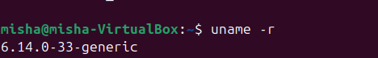

### Загруженные модули ядра
С помощью команды lsmod
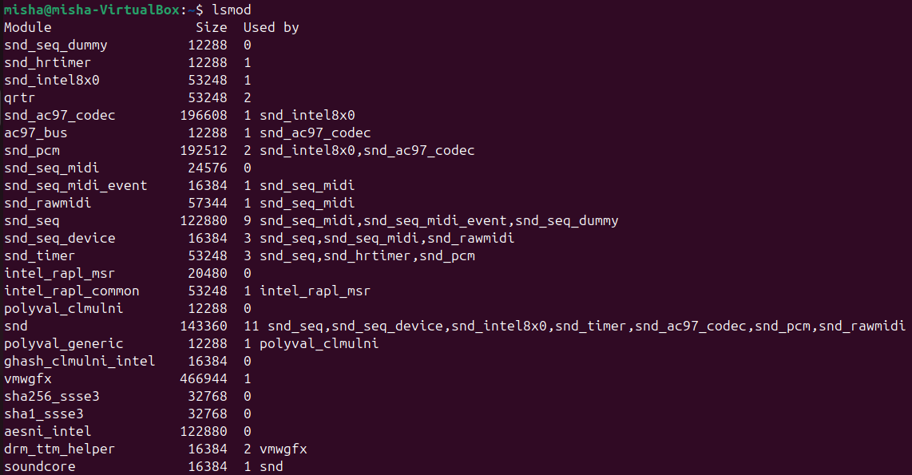
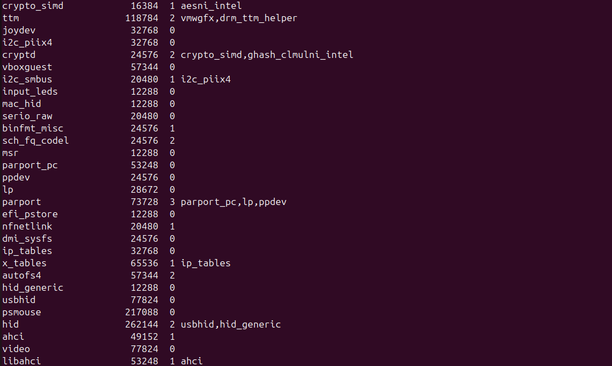
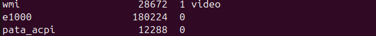

### Отключение автозагрузки модуля cdrom

За автоматичесвкую загрузку модулей отвечает modprobe.
По сути для отключения мы можем создать конфиг и указать cdrom в blacklist

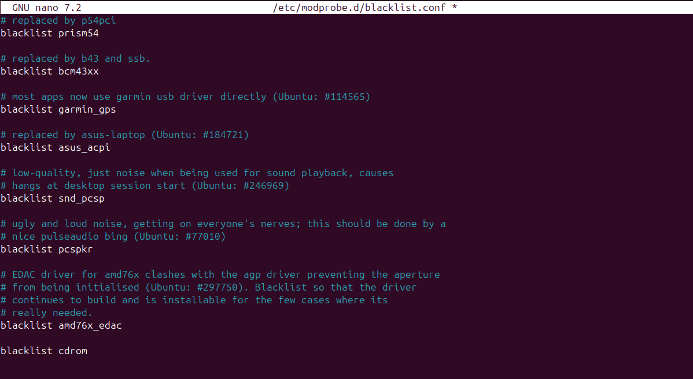

с помощью команды перезапустим систему
```
sudo reboot
```


Проверим наличие работы модуля 
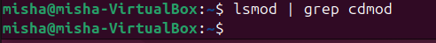
### Поиск и описание конфигурации
Для поиска конкретного параметра воспользуемся командой grep в файле с конфигурацией ядра


Значение m у параметра означает, что файловая система подключена как отдельный модуль, а не расположена в самом ядре


## Задание 2

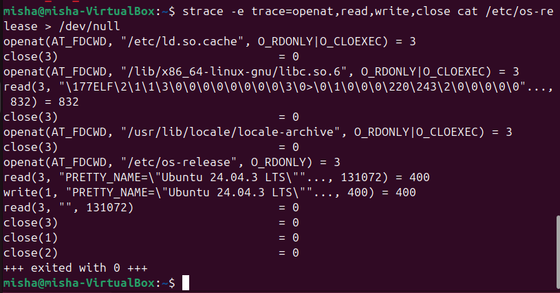

#### Разбор команды

Сама команда strace применяется для отслеживания процессов ядра Linux, применяемый на конкретную команду.

Для strace мы применяем еще фильтры указанные с помощью ```-e trace=openat,read,write,close```, 
для анализа конкретных процессов.

Конкретно команда ```cat  /etc/os-reales > /dev/null``` по сути читает из файла 
и записывает в /dev/null (по сути в пустоту).

#### Разбор вывода команды

Перед открытием самого файла /etc/os-release команда перед этим читает(openat) другие файлы и закрывает(close):
- /etc/ld.so.cache кэш для загрузки необходимых библиотек для команды  ```cat```
- /lib/x86_64-linux-gnu/lib.so.6 библиотека для системных вызовов ```read, write, open``` нужных как раз для ```cat```
- /usr/lib/locale/locale-archive файл, в котором содержится информация о строках для чтения

В конце после открытия /etc/os-release происходит чтение(read) и запись(write),
так как запись происходит в пустоту, то последующие чтение выводит 0.


## Задание 3

#### Добавление диска /dev/sdb 
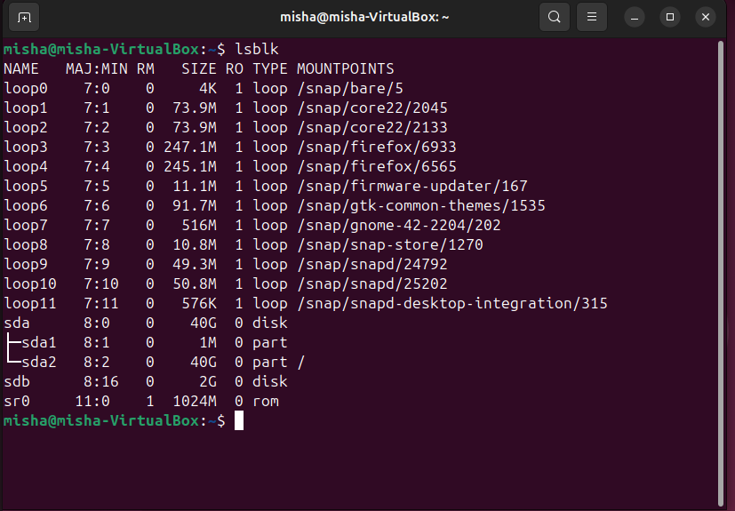

#### Создание раздела на /dev/sdb
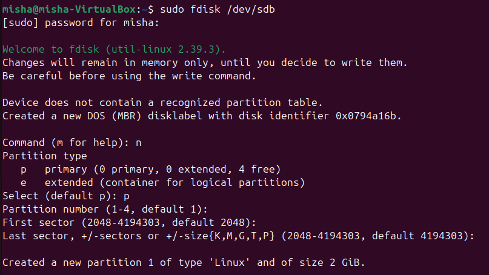

#### Создание Physical Volume(PV)
Устанвливаем пакет lvm2 с помощью ```sudo apt install lvm2```

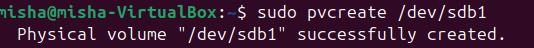

#### Создание Volume Group 
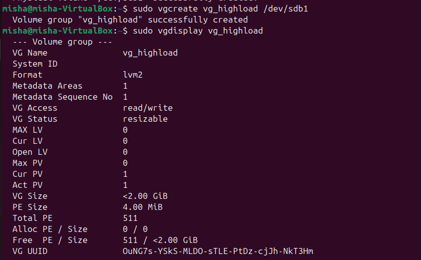

#### Создание Logical volume
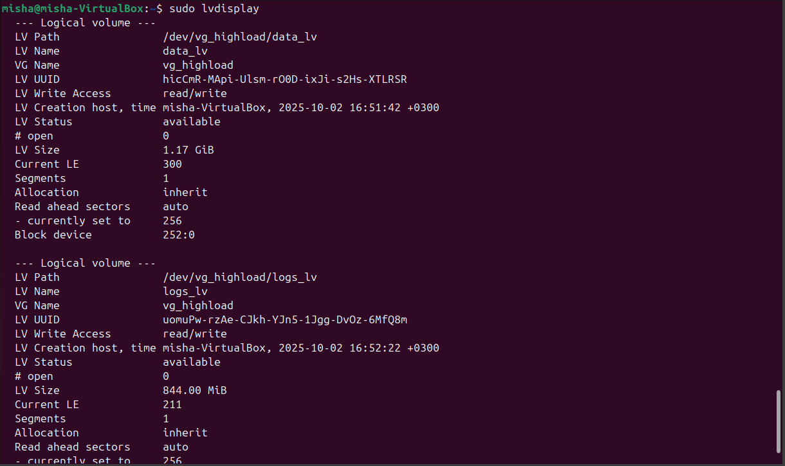

#### Отформатировать data_lv как xt4 и примонтировать в /mnt/app_data
Сделаем с помощью команд:
```
sudo mkfs.ext4 /dev/vg_highload/data_lv
sudo mkdir -p /mnt/app_data
sudo mount /dev/vg_highload/data_lv /mnt/app_data
```
Результат:
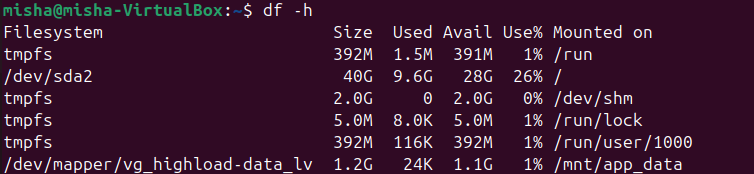
#### Отформатировать logs_lv как xfs и примонтировать в /mnt/app_logs
```
sudo mkfs.xfs /dev/vg_highload/logs_lv
sudo mkdir -p /mnt/app_logs
sudo mount /dev/vg_highload/logs_lv /mnt/app_logs
```

Результат:
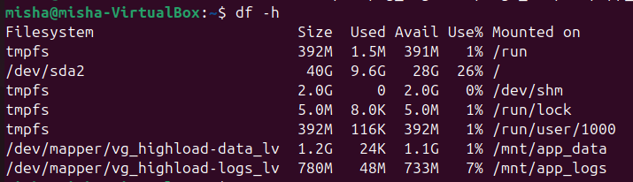

## Задание 4
#### Извлечь модель процессора и объем памяти
Информацию о процессоре можно найти в /proc/cpuinfo
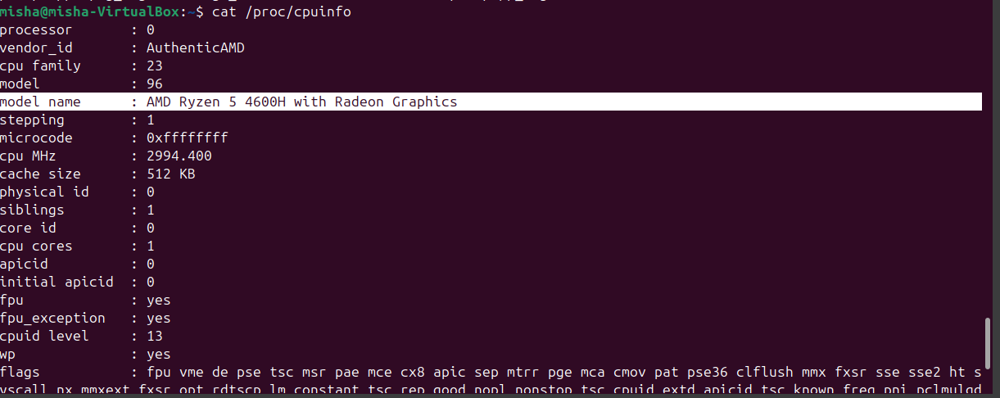


Информацию об объеме памяти можно в /proc/meminfo
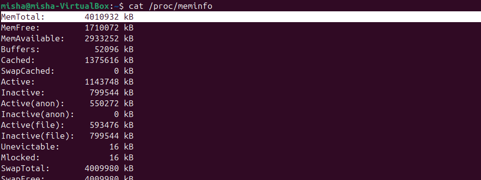
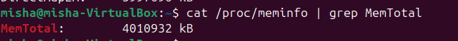

#### Поиск PPid


#### Определение настроек I/O scheduler для диска /dev/sda


В системе используется mq-deadline, он ускоряет доступ к ядру,
в этом случае запросы долго не ждут, так как у них есть дедлайн.

В случае ```none``` применяется только очередь самого диска.

#### Определение размера MTU основного сетевого интерфейса
Для начала определим какой интерфейс основной 


Найдем информацию для enp0s3
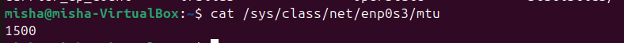