##  Задание 1. Systemd

Cоздадим файл для скрипта с помощью:

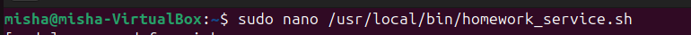

Сделаем его исполняем через ```sudo chmod +x /usr/local/bin/homework_service.sh```

С помощью sudo nano создадим systemd unit файл скрипта

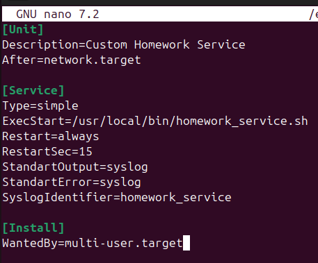

для перезапуска каждые 15 секунд укажем
```
Restart=always
RestartSec=15
```

С помощью команд systemctl запустим сервис
```
sudo systemctl daemon-reload
sudo systemctl enable homework.service
sudo systemctl start homework.service
```
проверим его статус через ```systemctl status homework.service```

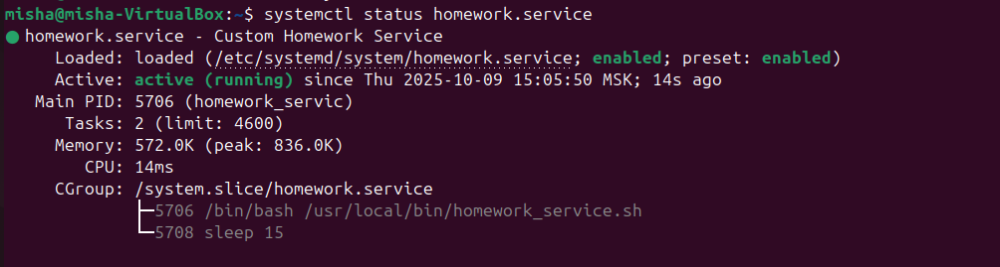

проверим логи скрипта

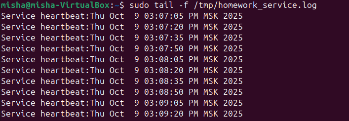

проверим перезапуск сервиса

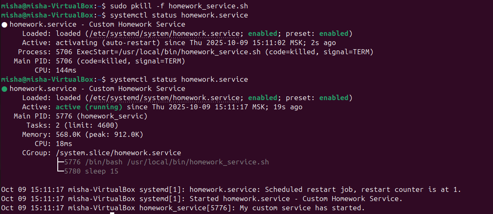

Первые пять самых длительных systemd unit'ов

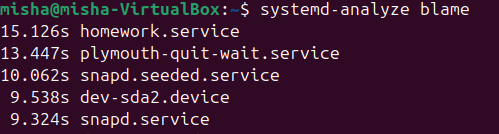

## Задание 2

Создадим файл с программой ```nano shm_creator.c```
Также скомпилируем и запустим программу

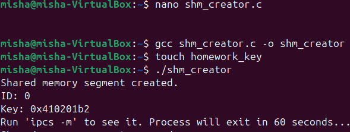

в отдельном окне используем ```ipcs -m```

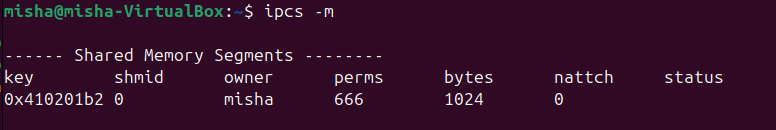

Вывод:
Конкретно поле natch равное 0 означает, ни один процесс не использует разделяемую память

## Задание 3

Запустим python скрипт, который выделяет 250 Мбайт

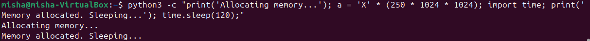

Найдем PID нужного процесса, в моем случае 6560

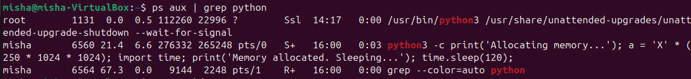

Проанализируем использование памяти для python скрипта

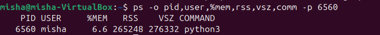

В самом скрипте мы выделяем 250 Мбайт, но RSS показывает 259 и 270 для VSZ при округлении.
- RSS реальная память, которую мы загружаем в оперативку
- VSZ размер виртуальной памяти

Я применил ```pmap```, чтоб детальней посмотреть, на что тратиться память

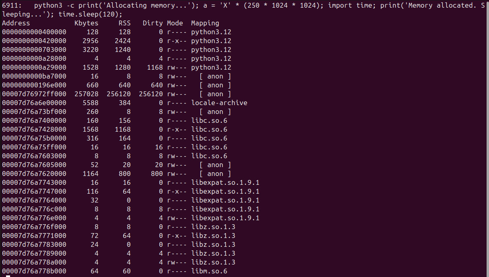
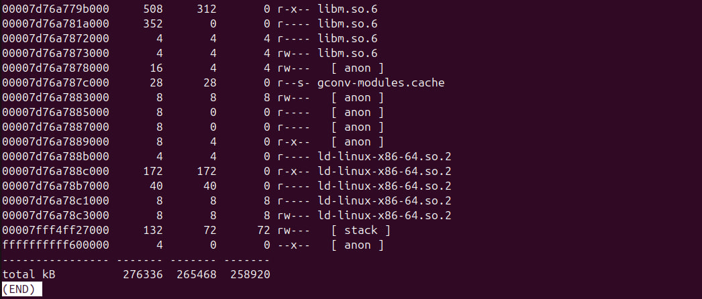

Мы видим что для всех процессов программы выделяется память виртуальная и физическая,
так как виртуальная резервируется наперед, то почти на каждый процессе ее больше, чем используемая уже физически.

## Задание 4 

Кол-во NUMA нод на моей виртуалке:

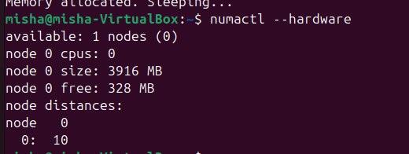

Ограничиваю процессы с помощью systemd

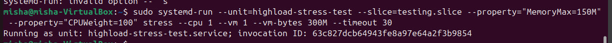
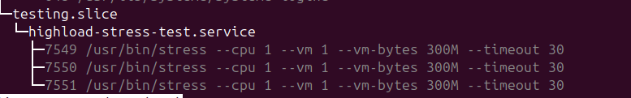

Посмотрим на реальные значения памяти процесса

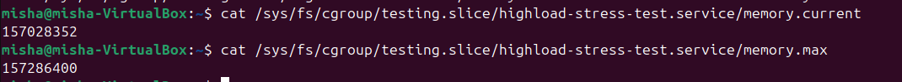

Взял другие значения и уменьшил объем памяти для stress

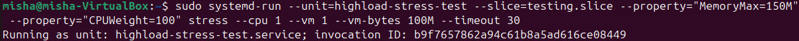
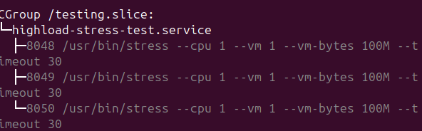

Посмотрим на реальные значения памяти процесса

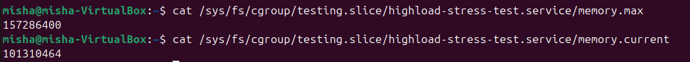

При повышении и понижении памяти с процессом, конкретно ничего не происходит, ошибок я не нашел,
но выделяема память действительно изменяется.
По сути MemoryMax ограничивает кол-во памяти оперативки на процесс, а с помощью CPUWeight мы можем приоритизировать процессы.