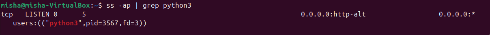
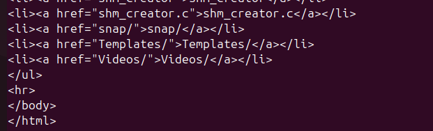
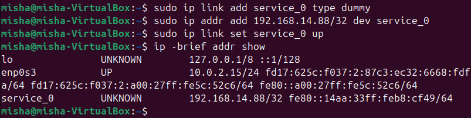
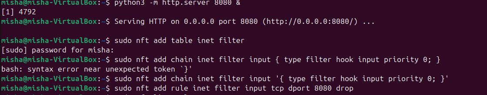
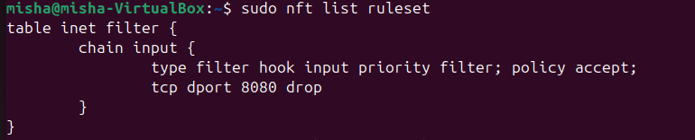
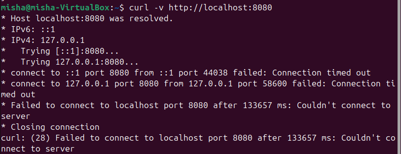
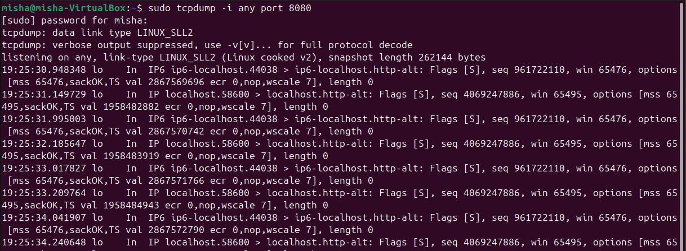
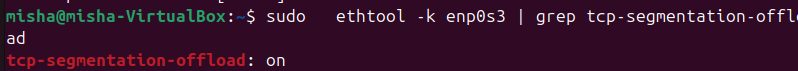

## Задание 1
Запустим Python http сервер

Поиск сокета с python сервера:

C помощью флага -a выведем все сокеты, но так как в таблице порты обозначены *, и
с помощью флага -p выведем описание процесса, и уже по описанию определим нужный.

С помощью curl подключимся к серверу

сокеты слушающие 8080 порт

TCP гарантирует надежность соединения, чтобы клиент с другой стороны не отправил на другой сервер, 
tcp после отправки данных ждет сигнал о закрытии.

Для протокола системно важно это состояние для гарантий надежности, поэтому его нельзя удалить.

При большом количестве TIME-WAIT сокетов система тратит ресурсы и занимаются порты, которые могут понадобиться.

## Задание 2
Создадим dummy-интерфейс service_0

## Задание 3
Создадим таблицу filter для протоколов IPv4 и IPv6(inet)

с помощью add rule и input tcp dport 8080 drop мы фильтруем все tcp запросы ан 8080 порт

Итоговый firewall

Пример запроса для проверки результата работы firewall

По результатам видно, что соединение закрывается при попытке подключения

## Задание 4
ethtool выведем свойства сетевого адаптера

TCP segmentation offload включен:

Благодаря TCP segmentation offload, cpu лишний раз не надо делить сетевой пакет на куски и добавлять заголовки для каждой части,
это уменьшает загрузку процессора и увеличивает пропускную способность сети