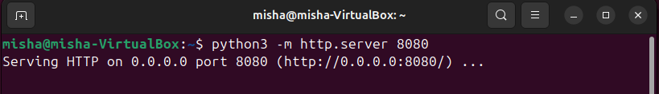
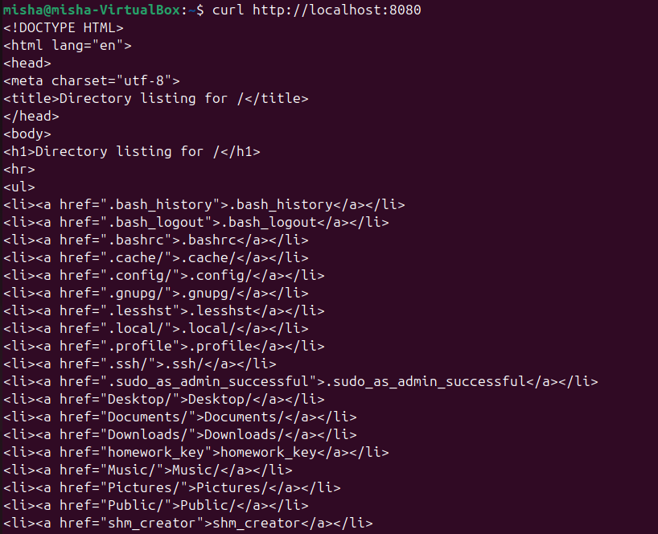
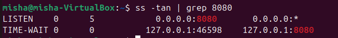

## Задание 1
Запустим Python http сервер

Поиск сокета с python сервера:

C помощью флага -a выведем все сокеты, но так как в таблице порты обозначены *, и
с помощью флага -p выведем описание процесса, и уже по описанию определим нужный.

С помощью curl подключимся к серверу

сокеты слушающие 8080 порт

TCP гарантирует надежность соединения, чтобы клиент с другой стороны не отправил на другой сервер, 
tcp после отправки данных ждет сигнал о закрытии.

Для протокола системно важно это состояние для гарантий надежности, поэтому его нельзя удалить.

При большом количестве TIME-WAIT сокетов система тратит ресурсы и занимаются порты, которые могут понадобиться.

## Задание 2
