## Задание 1
Создал папки с помощью mkdir с файлами index.html и запустил python http сервер: 
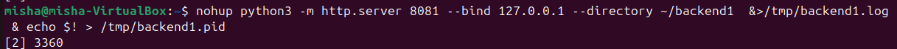

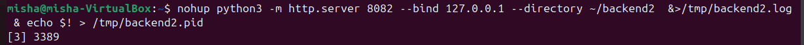

С помощью curl преверим работу серверов на python

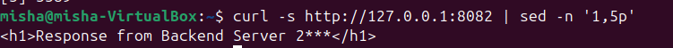

## Задание 2
Создадим конфиг для dnsmasq с указанием адресов 
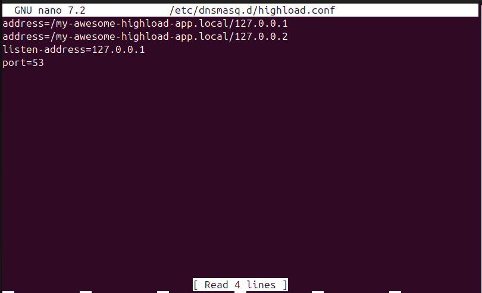

Проверка результата запуска dnsmasq:
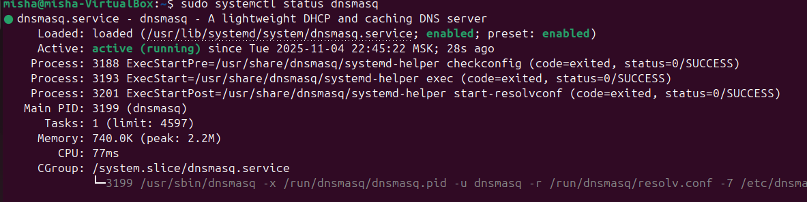

обращение для резолва через dig

Попробовал остановить один из серверов, чтоб проверить как работает
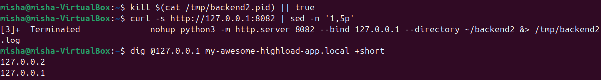

По сути dns не решает проблемы с отключенным вторым сервером, и нужно отдельно делать балансировщик нагрузки, который будет отправлять запросы на работающие сервера
## Задание 3
Создал интерфейс, на порту 80 работает виртуальный сервер с round robin алгоритмом распределения нагрузки, и два обычных сервера на портах 8081 и 8082: 
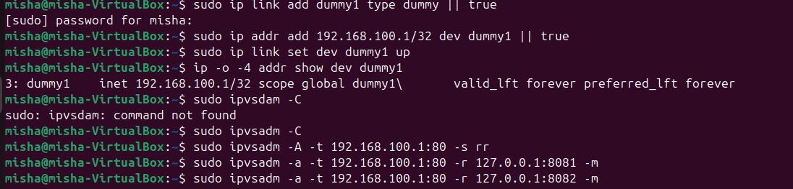

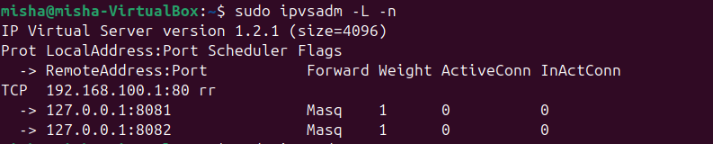

Результаты прогонов запросов и статистика:
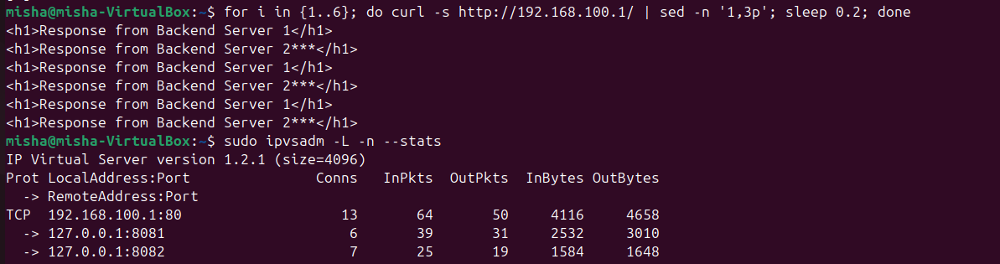
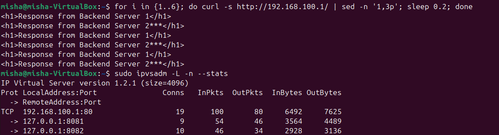

По данным из запроса видно, что запросы распределяются равномерно, разница в 1 из-за нечетного кол-ва запросов
## Задание 4
Создадим nginx конфигурацию для L7 балансировки
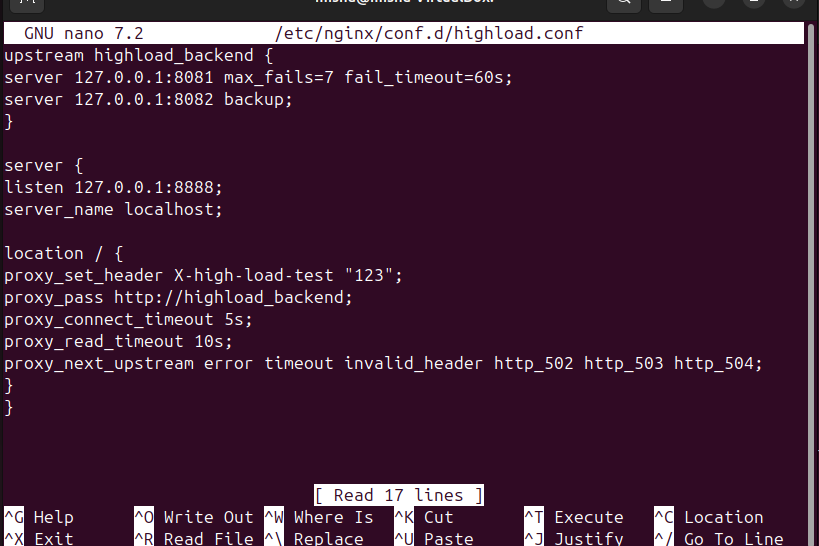
active-backup балансировка расположена на 8082 порту

для проверки работы балансировщика я выключил один серверов 
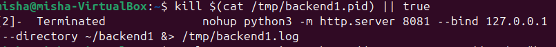

в tshark видим запрос на 8888 порт
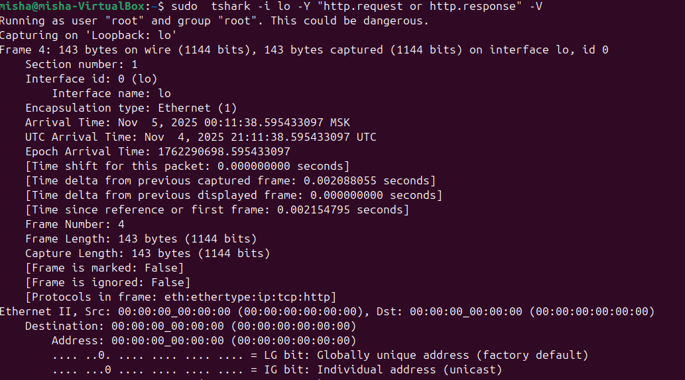
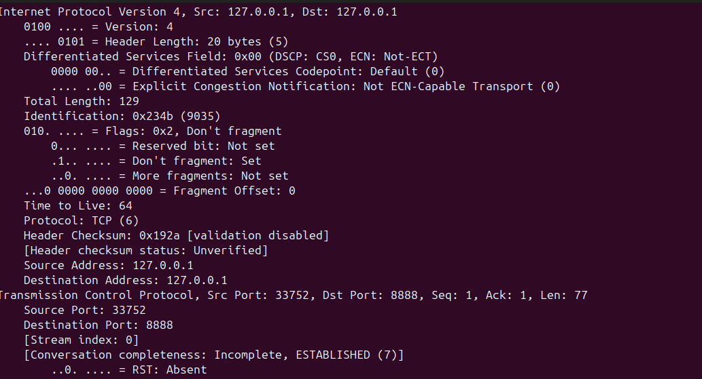
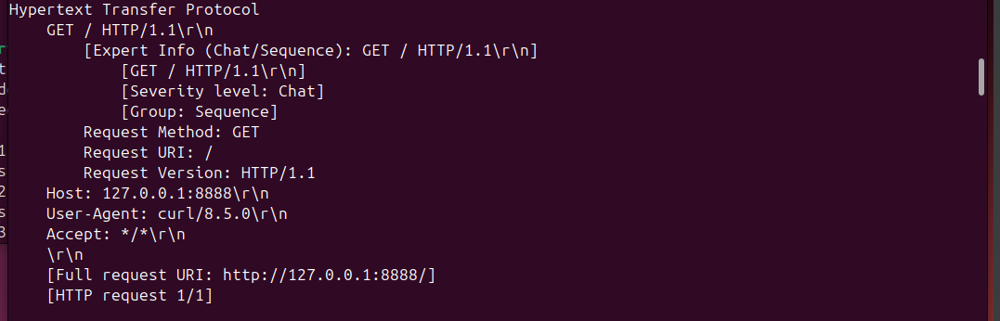

есть заголовок X-high-load-test: 123, который добавялет сам nginx

Результат ответа запроса обычного curl, возвращается ответ от backend2:
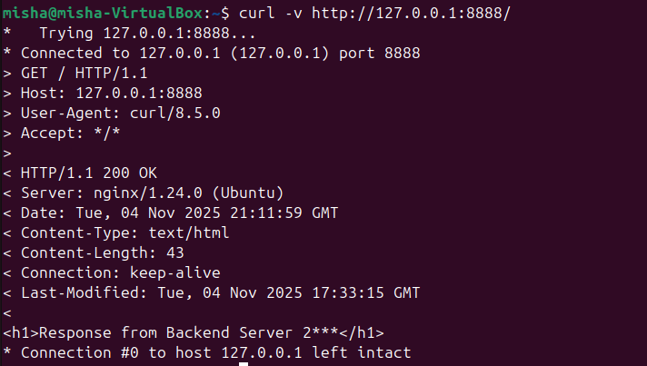
